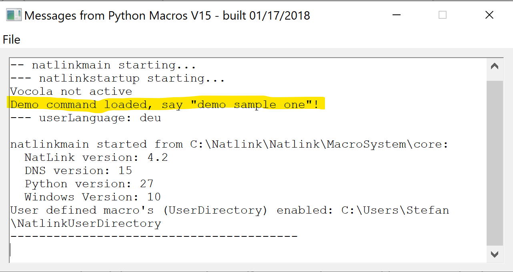
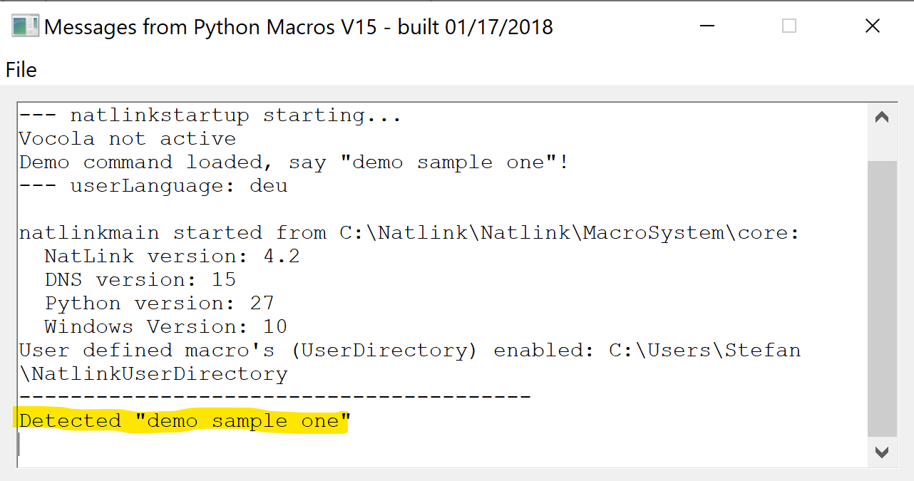

# Meta Installation Guide for Dragon Natlink Dragonfly

## Terminology

- **Dragon**
  - DPI (Dragon Professional Individual) often mitakenly set equal with DNS
- **Dragonfly**
- **Natlink**
- Unimacro
- Vocola

## Step-by-step Guide

0. Install python 2.7 (can be along python 3.x)
1. Install Dragon
  - 1.1 Upgrade to 15.3
2. Install Natlink (Vocola and Unimacro are just byproducts of Natlink) according to [this guide](https://qh.antenna.nl/unimacro/installation/installation.html)
3. The configuration part of step 2 is not comprehensible. We first need to install some python package to get the gui to run! (https://caster.readthedocs.io/en/latest/Installation/#manual-configuration)
4. Run **Configure NatLink via GUI** from start menu
5. Click **(re)Register NatLink**
6. Close GUI and restart Dragon: Another window for natlink should appear along Dragon if everything worked out fine.
7. [User Directory] Open GUI again, configure a User Directory (for custom commands)
8. [First Custom Command] put our [sample file](./_natlink_sample.py) into the directory, disable and re-enable Dragons microphone, this will make Natlink reimport all files in the User Directory. This should print **'Demo command loaded, say "demo sample one"!'** in the Natlink window.

9. Say *Demo Sample One* to trigger the custom command: It should print **Detected "demo sample one"**.

